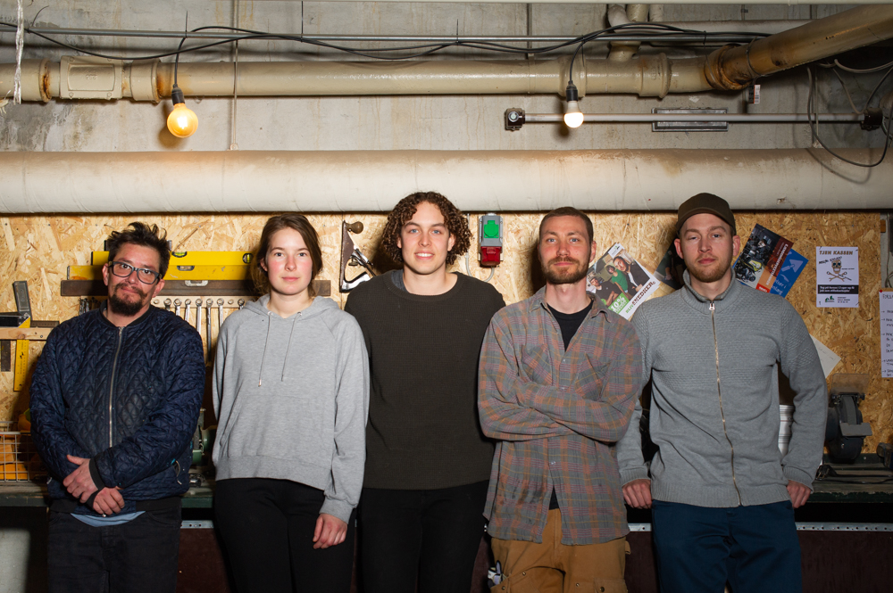

<!-- Guldminen består af en række Guldgraverprojekter. Alle arbejder på, at finde måder hvorpå vi kan genbruge så meget som muligt af det, der bliver afleveret på Vasbygade Genbrugscenter. Nogle Guldgravere arbejder med træ, andre med tøj, billerammer, værktøj osv. Herunder finder du en liste over de projekter, der er i TinkerTank. -->

<!-- 
  <h2>{{ member.name }} - {{ member.contact }}</h2>
  
{{ member.content | markdownify }}

 -->

	

		

		

		

		<!-- Break -->
		

		

		<!-- Break -->

	

	

		

		

		

		<!-- Break -->

		

		

		<!-- Break -->

	

	

		

		

		

		<!-- Break -->
		

		

<!-- 		

		

		

		

		

		

 -->

	

